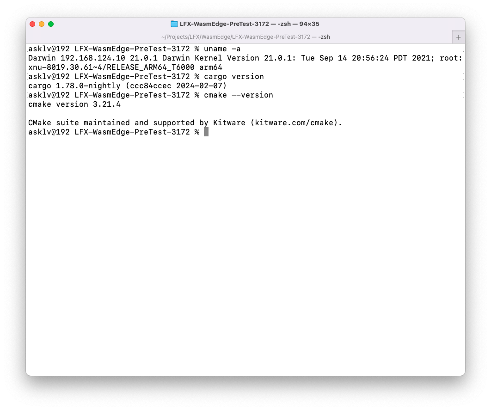
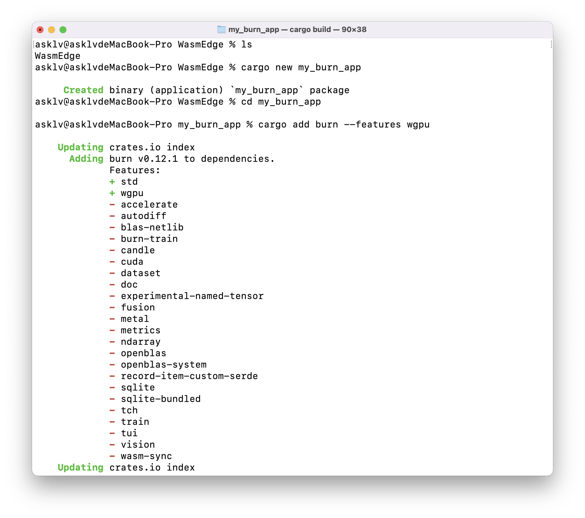
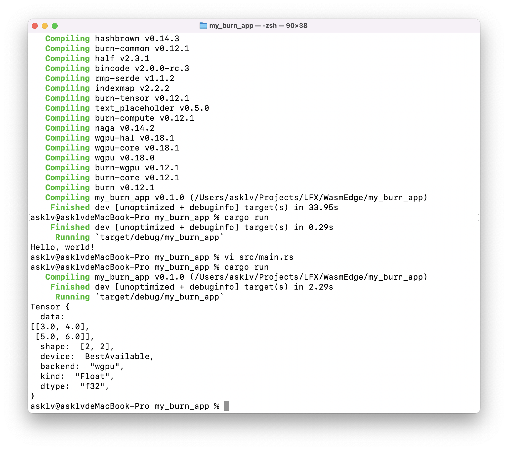
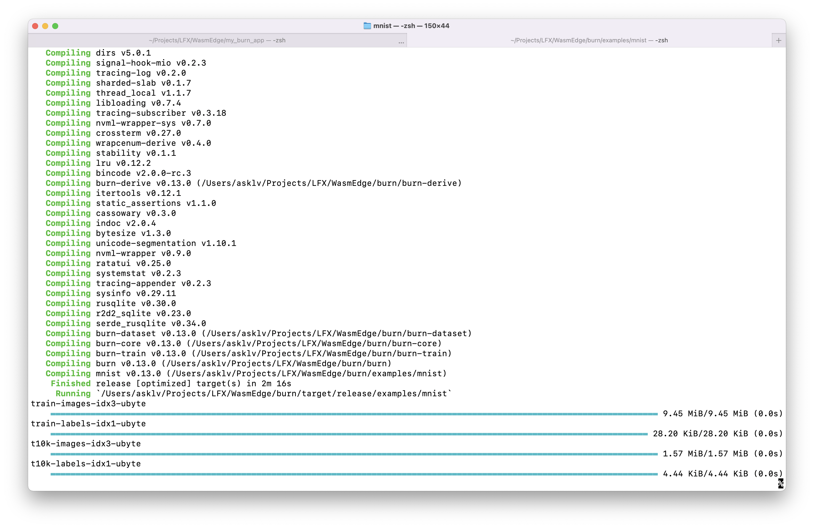
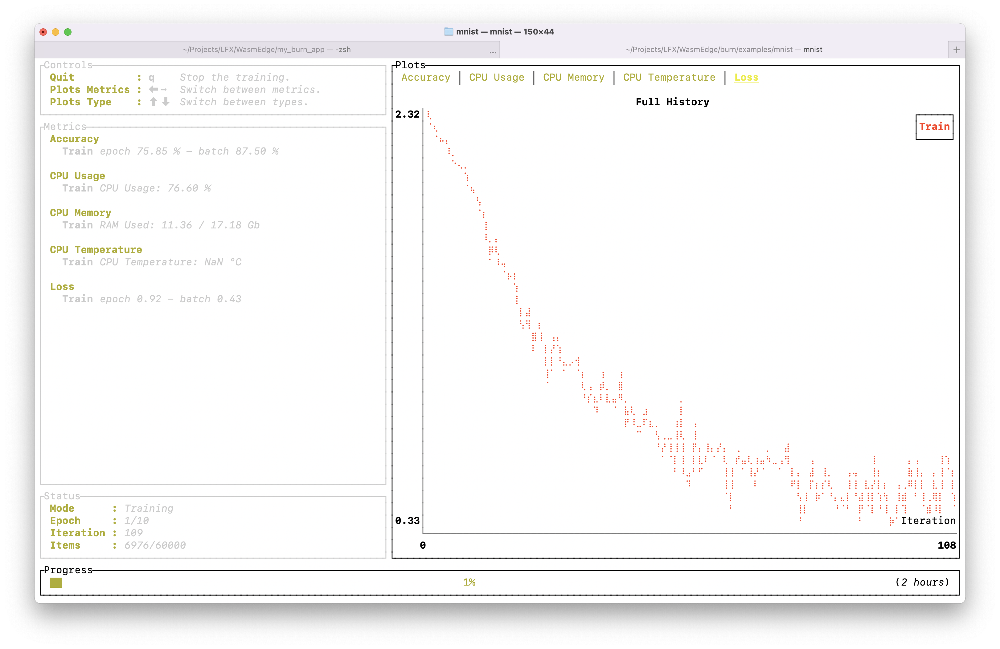
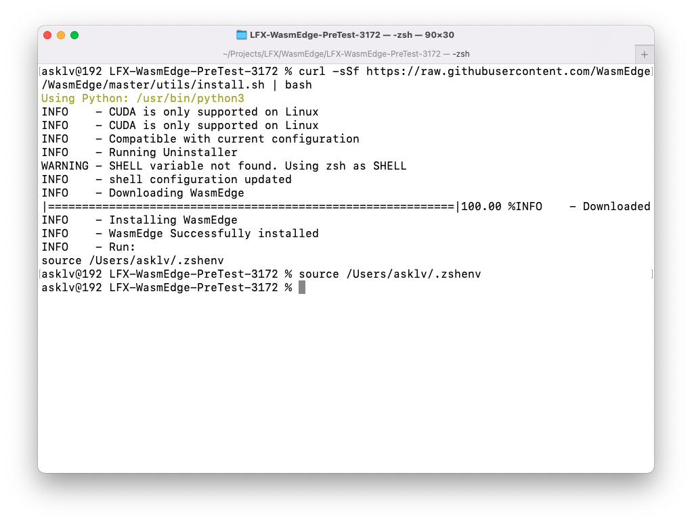
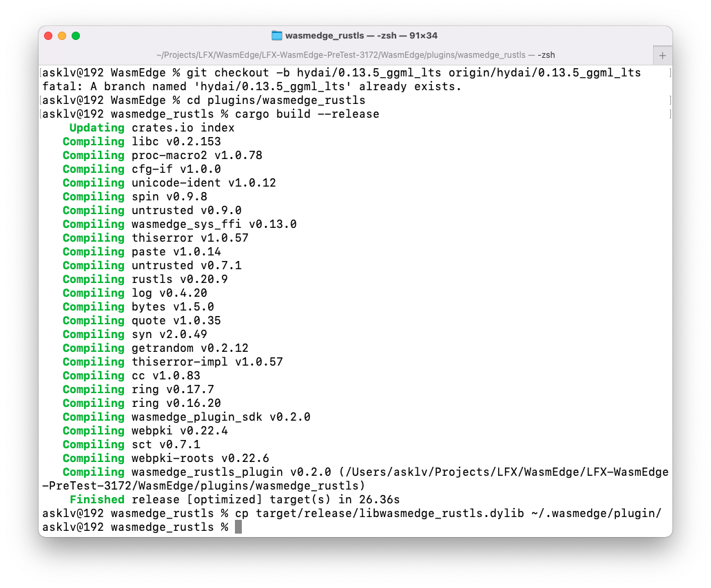
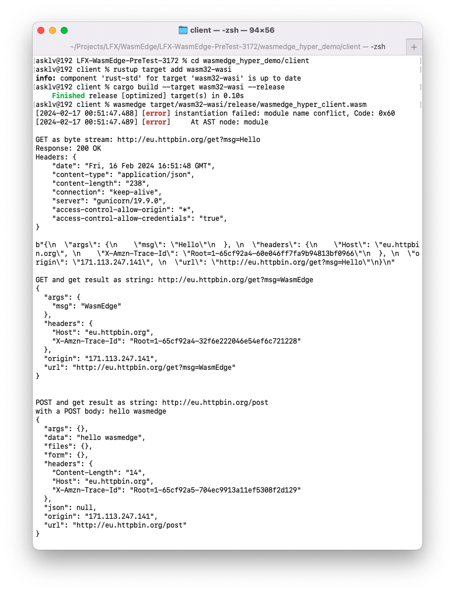
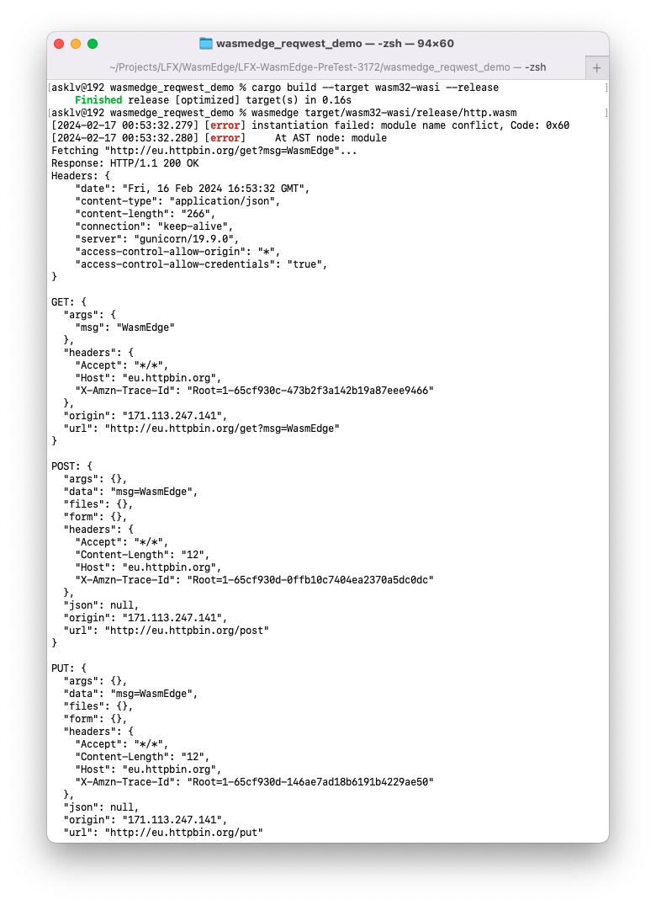

# LFX-WasmEdge-PreTest-3172

LFX Mentorship 2024-01 Pre-test for #3172.

## Table of Contents
- [LFX-WasmEdge-PreTest-3172](#lfx-wasmedge-pretest-3172)
  - [Table of Contents](#table-of-contents)
  - [1. Burn.rs Framework Execution](#1-burnrs-framework-execution)
    - [1.1 Create new project](#11-create-new-project)
    - [1.2 Update the project](#12-update-the-project)
    - [1.3 Build Burn Example in MNIST Dataset](#13-build-burn-example-in-mnist-dataset)
  - [2. Build with Rustls Plug-in](#2-build-with-rustls-plug-in)
    - [2.1 Build and execute the WasmEdge with Rustls plug-in](#21-build-and-execute-the-wasmedge-with-rustls-plug-in)
    - [2.2 Test the WasmEdge examples with Rustls plug-in](#22-test-the-wasmedge-examples-with-rustls-plug-in)
      - [2.2.1 Test the `hyper` example](#221-test-the-hyper-example)
      - [2.2.2 Test the `reqwest` example](#222-test-the-reqwest-example)
  - [3. Some problems in the pre-test](#3-some-problems-in-the-pre-test)
  - [4. Try to integrate the WasmEdge with Burn.rs](#4-try-to-integrate-the-wasmedge-with-burnrs)


## 1. Burn.rs Framework Execution

**Environment:**
- MacOS 12.0 Darwin Kernel Version 21.0.1/arm64 
- Rust 1.78.0-nightly (ccc84ccec 2024-02-07)
- Cmake 3.21.4



### 1.1 Create new project

Try to create a new project with `burn` framework, and use `wgpu` or `ndarrary` as the backend. We choose `wgpu` as default.

```bash
cargo new my_burn_app
cd my_burn_app
cargo add burn --features wgpu
cargo build
```



### 1.2 Update the project

Use Tensor to do some simple operations.

```rs
use burn::tensor::Tensor;
use burn::backend::Wgpu;

// Type alias for the backend to use.
type Backend = Wgpu;

fn main() {
    let device = Default::default();
    // Creation of two tensors, the first with explicit values and the second one with ones, with the same shape as the first
    let tensor_1 = Tensor::<Backend, 2>::from_data([[2., 3.], [4., 5.]], &device);
    let tensor_2 = Tensor::<Backend, 2>::ones_like(&tensor_1);

    // Print the element-wise addition (done with the WGPU backend) of the two tensors.
    println!("{}", tensor_1 + tensor_2);
}
```



> Ref: https://burn.dev/book/getting-started.html

### 1.3 Build Burn Example in MNIST Dataset

Try to clone `Burn` repository and build the example in `mnist`.

In Apple Silicon, we need to use `--features ndarray` to build the example.

```bash
git clone https://github.com/tracel-ai/burn.git
cd burn
cargo run --example mnist --release --features ndarray
```



We can see the console dashboard of the training example.



> Ref: https://github.com/tracel-ai/burn/tree/main/examples/mnist

## 2. Build with Rustls Plug-in

We have add repos in submodule, so we can build the WasmEdge with Rustls plug-in in current directory.

And we need to install the WasmEdge first.

```bash
curl -sSf https://raw.githubusercontent.com/WasmEdge/WasmEdge/master/utils/install.sh | bash
source $HOME/.wasmedge/env
```



> Ref: https://wasmedge.org/docs/contribute/source/plugin/rusttls

### 2.1 Build and execute the WasmEdge with Rustls plug-in

We try to fork the WasmEdge repository and build the WasmEdge with Rustls plug-in in `hydai/0.13.5_ggml_lts` branch.

```bash
# Pull the submodule
git submodule update --init --recursive
cd WasmEdge
git checkout hydai/0.13.5_ggml_lts
cd plugins/wasmedge_rustls
cargo build --release
```



Then we can build the WasmEdge with Rustls plug-in.

### 2.2 Test the WasmEdge examples with Rustls plug-in   

We choose the `hyper` and `reqwest` examples to test the WasmEdge with Rustls plug-in.

We need to install the `wasm32-wasi` target first.
```bash
rustup target add wasm32-wasi
```

#### 2.2.1 Test the `hyper` example

```bash
cd wasmedge_hyper_demo/client
cargo build --target wasm32-wasi --release
wasmedge target/wasm32-wasi/release/wasmedge_hyper_client.wasm
```



We can see the console output of the `hyper` example. The client sends requests to http://eu.httpbin.org/get?msg=Hello and receives the response.

> Tips: we have tested the example, so it trowed the name conflict  error of `hyper` example.

#### 2.2.2 Test the `reqwest` example

```bash
cd wasmedge_reqwest_demo
cargo build --target wasm32-wasi --release
wasmedge target/wasm32-wasi/release/https.wasm
```



We can see the console output of the `reqwest` example.

> Tips: we have tested the example, so it trowed the name conflict  error of `reqwest` example.

## 3. Some problems in the pre-test

I have meet some problems in the pre-test, and I find the reson in previous issues: https://github.com/WasmEdge/WasmEdge/issues/2448.

It was caused by the environment of `WASMEDGE_INCLUDE_DIR` is not set correctly.

## 4. Try to integrate the WasmEdge with Burn.rs

In wasmedge_rustls_api(https://github.com/second-state/wasmedge_rustls_api) repository, we can find the example of `wasmedge_rustls_api` and `wasmedge_rustls_api_client`, so we can use `hyper_wasi` and `reqwest` to integrate the WasmEdge with Burn.rs.

In hyper demo, the `wasmedge_hyper_rustls` create the connection with tls support in `wasm_rustls_api`. We can use the `wasmedge_hyper_rustls` to integrate the WasmEdge with Burn.rs.

So, we can refer to the `wasmedge_hyper_rustls` to integrate the WasmEdge with `Burn.rs`.(Like `PyTorch` in WasmEdge.)